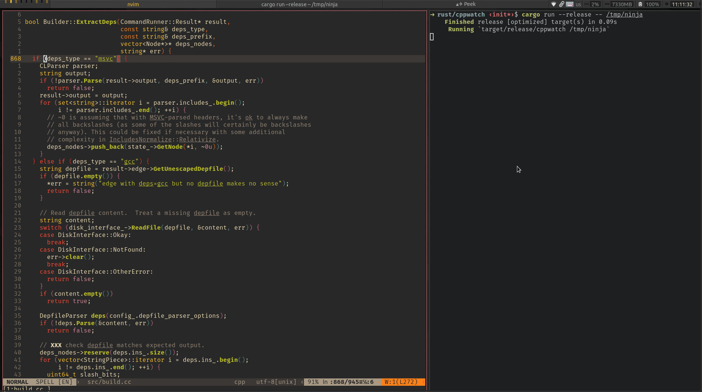

# About

[](https://gitlab.com/alexssh/modbus-tools/-/commits/master)
[](https://opensource.org/licenses/MIT)

cppwatch watches for changes in C/++ source files and runs build/test commands,
collects measurements, shows desktop notifications and reports. It's like
[cargo-watch](https://github.com/watchexec/cargo-watch) but adapted for use with
C/C++ projects and has some additional features I found helpful during
day-to-day usage.

# Usage

Here is a short example with tracking changes in [ninja](https://github.com/ninja-build/ninja)



Run:

```
cppwatch /tmp/ninja

```

After detecting changes in source files, cppwatch executes build / test commands
and print short report like:

```
========================================
Build 5
========================================
Build duration:          1656 ms
Build duration avg:      1593 ms
Build duration delta:    63 ms

Test duration:           612 ms
Test duration avg:       577 ms
Test duration delta:     35 ms

Pass ratio:              100 % [5/5]
========================================
Status: done
========================================
```


The command line arguments allow configuring the app behavior. For example,
building sources with ninja and skipping tests will look like this:

```
cppwatch /tmp/ninja --build-command "ninja" --test-command ""
```

# Build

```
cargo build
```
